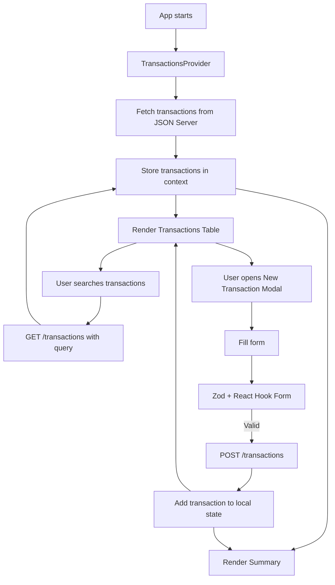
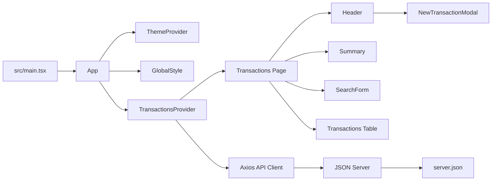

# 💰 Ignite DT Money

<h3 align="center">
  A personal finance dashboard built with React, TypeScript, Vite, Styled Components, React Hook Form, Zod and JSON Server.
</h3>

<p align="center">
  <strong>Transactions · Income and outcome tracking · Search · Summary cards · Modal form · Fake REST API</strong>
</p>

<p align="center">
  
  
  
  
  
</p>

---

## 📌 About the Project

**Ignite DT Money** is a personal finance control application inspired by Rocketseat's Ignite track.

The app allows users to list financial transactions, create new income or outcome entries, search transactions, and visualize a summary with income, outcome and total balance values.

The project uses a modern React stack with **React 19**, **TypeScript**, **Vite**, **Styled Components**, **React Hook Form**, **Zod**, **Radix UI**, **Axios**, **JSON Server** and **use-context-selector**.

### 🇧🇷 Descrição em Português

O **Ignite DT Money** é uma aplicação de controle financeiro pessoal. O usuário pode cadastrar transações de entrada e saída, listar transações, buscar por registros e visualizar um resumo financeiro com entradas, saídas e saldo total.

---

## 🎯 Project Goal

The goal of this project is to practice a realistic financial dashboard using React and modern frontend patterns.

The project covers:

- component-based architecture
- global state with context
- optimized context consumption
- API communication
- fake backend persistence
- transaction creation
- transaction search
- form validation
- modal UI
- currency/date formatting
- styled theme system

---

## ✨ Features

- List financial transactions
- Register a new transaction
- Select transaction type:
  - Income
  - Outcome
- Add description
- Add price
- Add category
- Store transactions in JSON Server
- Fetch transactions from API
- Sort transactions by creation date
- Search transactions by query
- Display income summary
- Display outcome summary
- Display total balance
- Format prices as BRL currency
- Format dates using Brazilian locale
- Modal form with Radix Dialog
- Radio group for transaction type
- React Hook Form integration
- Zod validation schema
- Styled Components theme
- Global styles
- Optimized context reads with `use-context-selector`

---

## 🧠 How It Works



---

## 🏗️ Architecture



---

## 🛠️ Tech Stack

| Technology | Usage |
|---|---|
| React 19 | UI library |
| TypeScript | Static typing |
| Vite 6 | Development/build tool |
| Styled Components | Component styling and theme |
| React Hook Form | Form handling |
| Zod | Form schema validation |
| @hookform/resolvers | Zod resolver integration |
| Radix Dialog | Accessible modal dialog |
| Radix Radio Group | Transaction type selection |
| Axios | HTTP client |
| JSON Server | Fake REST API |
| use-context-selector | Optimized context consumption |
| Phosphor React | Icons |
| ESLint | Code quality |

---

## 📁 Project Structure

```bash
ignite-dt-money/
├── public/
├── src/
│   ├── assets/
│   ├── components/
│   │   ├── Header/
│   │   ├── NewTransactionModal/
│   │   └── Summary/
│   ├── contexts/
│   │   └── TransactionsContext.tsx
│   ├── hooks/
│   │   └── useSummary.ts
│   ├── lib/
│   │   └── axios.ts
│   ├── pages/
│   │   └── Transactions/
│   │       └── components/
│   │           └── SearchForm/
│   ├── styles/
│   │   ├── global.ts
│   │   └── themes/
│   │       └── default.ts
│   ├── utils/
│   │   └── formatter.ts
│   ├── App.tsx
│   └── main.tsx
├── server.json
├── package.json
├── vite.config.ts
└── README.md
```

---

## 📄 Main Files

| File | Description |
|---|---|
| `src/main.tsx` | React entry point |
| `src/App.tsx` | Theme provider, global styles, context provider and page rendering |
| `src/contexts/TransactionsContext.tsx` | Transactions state, API fetch and create logic |
| `src/lib/axios.ts` | Axios API client |
| `src/pages/Transactions/index.tsx` | Main page with header, summary, search and table |
| `src/components/Header/index.tsx` | Header and new transaction button |
| `src/components/NewTransactionModal/index.tsx` | Transaction creation modal and form |
| `src/components/Summary/index.tsx` | Income, outcome and total cards |
| `src/hooks/useSummary.ts` | Calculates financial summary |
| `src/pages/Transactions/components/SearchForm/index.tsx` | Search form and query submission |
| `src/utils/formatter.ts` | Currency and date formatters |
| `src/styles/global.ts` | Global styles |
| `src/styles/themes/default.ts` | Default theme tokens |
| `server.json` | Fake API database |

---

## ⚙️ Requirements

- Node.js 18 or newer
- npm

---

## ▶️ Running Locally

Clone the repository:

```bash
git clone https://github.com/yruamkaffer/ignite-dt-money.git
cd ignite-dt-money
```

Install dependencies:

```bash
npm install
```

Start JSON Server:

```bash
npm run dev:server
```

In another terminal, start the frontend:

```bash
npm run dev
```

Open in the browser:

```txt
http://localhost:5173
```

The fake API runs on:

```txt
http://localhost:3000
```

---

## 🧪 Available Scripts

```bash
npm run dev
```

Starts the Vite development server.

```bash
npm run dev:server
```

Starts JSON Server using `server.json` with a 500ms delay.

```bash
npm run lint
```

Runs ESLint over TypeScript and TSX files.

```bash
npm run lint:fix
```

Runs ESLint and automatically fixes issues when possible.

```bash
npm run build
```

Runs TypeScript build and creates a production Vite bundle.

```bash
npm run preview
```

Previews the production build locally.

---

## 🔌 Fake API

The app uses JSON Server with this base URL:

```txt
http://localhost:3000
```

### Transactions Resource

```http
GET /transactions
GET /transactions?_sort=createdAt&_order=desc&q=search
POST /transactions
```

### Transaction Model

```json
{
  "id": 1,
  "description": "Desenvolvimento de software",
  "type": "income",
  "category": "Venda",
  "price": 140000,
  "createdAt": "2025-05-21T23:44:02.088Z"
}
```

---

## 🧾 Transaction Form

The new transaction modal includes:

| Field | Type |
|---|---|
| Description | Text |
| Price | Number |
| Category | Text |
| Type | Income / Outcome |

The form uses:

- React Hook Form
- Zod schema
- Radix Dialog
- Radix Radio Group
- `Controller` for controlled radio input

---

## 📊 Summary

The dashboard summary displays:

| Card | Meaning |
|---|---|
| Entradas | Sum of all income transactions |
| Saídas | Sum of all outcome transactions |
| Total | Income minus outcome |

Prices are formatted as Brazilian Real using `Intl.NumberFormat`.

Dates are formatted using `Intl.DateTimeFormat('pt-BR')`.

---

## 🔎 Search

The search form allows users to search transactions by query.

The query is sent to JSON Server through the `q` parameter:

```http
GET /transactions?q=food
```

The results are sorted by `createdAt` in descending order.

---

## 🎨 UI Details

The interface includes:

- Dark financial dashboard layout
- Header with logo
- New transaction button
- Summary cards
- Transactions table
- Income/outcome color highlights
- Modal overlay
- Styled Components theme tokens
- Accessible modal foundation through Radix UI
- BRL currency formatting
- Brazilian date formatting

---

## 🧪 QA Opportunities

Suggested manual QA scenarios:

| Scenario | Expected Result |
|---|---|
| Open app with API running | Transactions load from JSON Server |
| Open app without API | App should handle request failure gracefully |
| Create income transaction | Transaction appears at top of list |
| Create outcome transaction | Transaction appears with negative visual style |
| Create transaction | Summary updates |
| Search existing transaction | Matching results appear |
| Search nonexistent transaction | Empty result is shown |
| Submit empty modal | Required field validation blocks submit |
| Enter numeric price | Price is stored as number |
| Select income type | Transaction is created as income |
| Select outcome type | Transaction is created as outcome |
| Run build | Project compiles successfully |

---

## 🧭 Roadmap / Future Improvements

- [ ] Add screenshots or GIFs to this README
- [ ] Add live demo link
- [ ] Fix summary calculation hook if needed
- [ ] Add error handling for API failures
- [ ] Add loading states for list and form
- [ ] Add empty state for no transactions
- [ ] Add stronger Zod validation messages
- [ ] Add `.env.example` for API base URL
- [ ] Move API URL to `VITE_API_URL`
- [ ] Add delete transaction feature
- [ ] Add edit transaction feature
- [ ] Add category filters
- [ ] Add date filters
- [ ] Add monthly summaries
- [ ] Add charts
- [ ] Add localStorage fallback
- [ ] Add unit tests for `useSummary`
- [ ] Add component tests for modal/search
- [ ] Add GitHub Actions for lint/build/tests

---

## ⚠️ Notes

- This project uses JSON Server as a fake backend.
- The frontend expects the API to be available at `http://localhost:3000`.
- The current README mentions MirageJS, but the current implementation uses JSON Server.
- This project is based on a Rocketseat Ignite learning challenge.
- It is a strong front-end portfolio project because it includes API calls, forms, context, formatting and a real dashboard flow.

---

## 💡 What I Learned

This project helps practice:

- React with TypeScript
- Vite setup
- Styled Components
- theme providers
- global styles
- Context API patterns
- optimized context selectors
- API integration with Axios
- fake backend with JSON Server
- form handling with React Hook Form
- schema validation with Zod
- modal composition with Radix UI
- currency/date formatting
- memoization with `useMemo`
- search forms and query params

---

## 👨‍💻 Author

Developed by **Yruam Käffer de Faria**.
